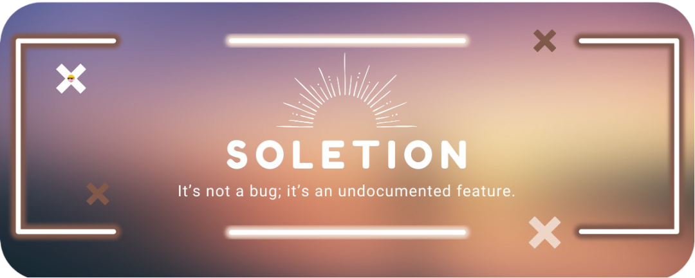

<!-- Header -->

  

<!-- Typing SVG -->

  

## 💫 Sobre mí

👋 ¡Hola! Soy **Sol**, **Junior Web Developer** en constante evolución.  
💼 Actualmente desarrollo aplicaciones web y refuerzo mis habilidades día a día.  
🌱 Estoy aprendiendo: **React**, **AWS**, **IA** y **API REST**.  
⚡ Dato curioso: ¡Soy **criminóloga**!  
📚 Apasionada por la tecnología, la resolución de problemas y el aprendizaje continuo.

 

## 🌐 Contacto

  
  
  

## 🛠️ Habilidades técnicas

  
  
  
  
  
  
   
  
  
  
  
  
  
  

## 📊 Estadísticas de GitHub

  
  &nbsp;&nbsp;&nbsp;&nbsp;
  

## 🐍 Mi serpiente devoradora de contribuciones

  

## 🎧 Lo que estoy escuchando ahora

  

## 👀 Visitas a mi perfil

  

